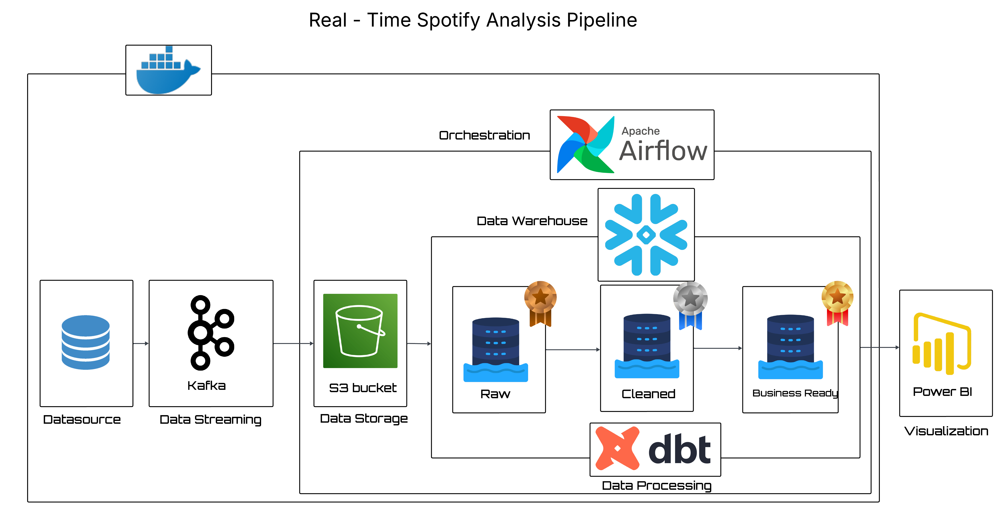
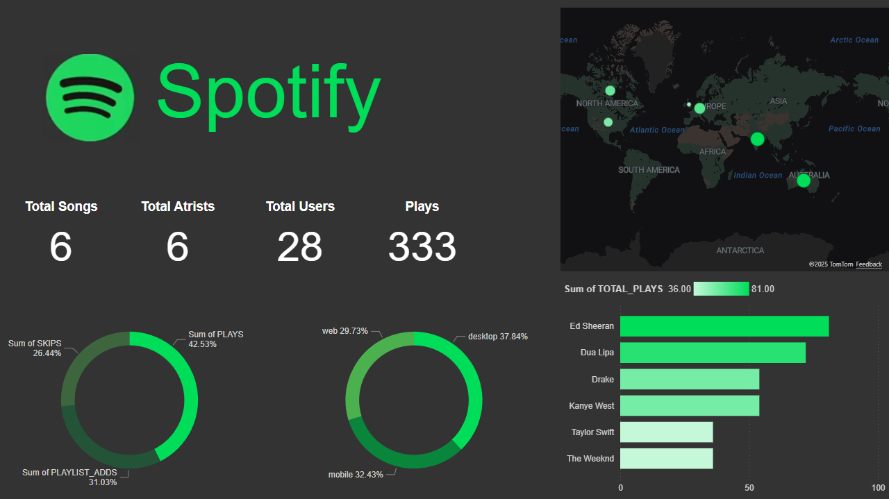

# 🎧 Spotify Data Pipeline

> **End-to-End Streaming Analytics Platform**

A production-grade streaming data engineering pipeline that simulates Spotify user activity and processes events through a modern data stack — from real-time ingestion to analytics-ready datasets and interactive dashboards.

[](https://opensource.org/licenses/MIT)
[](https://www.python.org/)
[](https://www.docker.com/)

---

## 📋 Table of Contents

- [Overview](#-overview)
- [Architecture](#-architecture)
- [Tech Stack](#-tech-stack)
- [Project Structure](#-project-structure)
- [Data Flow](#-data-flow)
- [Getting Started](#-getting-started)
- [Analytics Examples](#-analytics-examples)
- [Best Practices](#-best-practices)
- [Future Enhancements](#-future-enhancements)
- [Contributing](#-contributing)
- [Author](#-author)

---

## 🎯 Overview

This project demonstrates **professional data engineering practices** through a comprehensive streaming analytics pipeline. It showcases:

- ✅ Real-time event streaming with Apache Kafka
- ✅ Medallion architecture (Bronze/Silver/Gold layers)
- ✅ Workflow orchestration and automation
- ✅ Modern data transformation with dbt
- ✅ Cloud data warehouse analytics
- ✅ Business intelligence visualization
- ✅ Containerized infrastructure

**Perfect for:** Data engineers, analytics engineers, and anyone looking to understand modern data stack implementation.

---

## 🏗️ Architecture

<div align="center">
  
</div>

### **Data Flow Visualization**

```
┌─────────────┐      ┌─────────┐      ┌──────────┐      ┌─────────────┐
│   Producer  │─────▶│  Kafka  │─────▶│ Consumer │─────▶│MinIO(Bronze)│
│  (Spotify)  │      │         │      │          │      │  Data Lake  │
└─────────────┘      └─────────┘      └──────────┘      └──────┬──────┘
                                                                │
                                                                ▼
                                                        ┌───────────────┐
                                                        │    Airflow    │
                                                        │ Orchestration │
                                                        └───────┬───────┘
                                                                │
                                                                ▼
                                                        ┌───────────────┐
                                                        │   Snowflake   │
                                                        │ Bronze Tables │
                                                        └───────┬───────┘
                                                                │
                                                                ▼
                                                        ┌───────────────┐
                                                        │      dbt      │
                                                        │ Silver & Gold │
                                                        └───────┬───────┘
                                                                │
                                                                ▼
                                                        ┌───────────────┐
                                                        │   Power BI    │
                                                        │  Dashboards   │
                                                        └───────────────┘
```

### **Medallion Architecture Layers**

| Layer | Purpose | Technology |
|-------|---------|------------|
| **Bronze** | Raw, immutable data ingestion | MinIO + Snowflake |
| **Silver** | Cleaned, validated, typed data | dbt staging models |
| **Gold** | Business-ready analytics tables | dbt marts |

---

## 🧰 Tech Stack

| Component | Technology | Purpose |
|-----------|-----------|---------|
| **Event Generation** | Python, Faker | Simulate realistic user behavior |
| **Message Broker** | Apache Kafka | Real-time event streaming |
| **Data Lake** | MinIO | S3-compatible object storage |
| **Orchestration** | Apache Airflow | Workflow automation & scheduling |
| **Data Warehouse** | Snowflake | Cloud-based analytics platform |
| **Transformation** | dbt | Analytics engineering & modeling |
| **Visualization** | Power BI | Interactive dashboards |
| **Infrastructure** | Docker & Docker Compose | Containerized services |

---

## 📁 Project Structure

```
spotify-data-pipeline/
│
├── images/                        # Documentation images
│   ├── architecture_diagram.png   # Architecture visualization
│   └── spotify_dashboard.png      # Power BI dashboard
│
├── producer/                      # Event generation
│   └── spotify_producer.py        # Simulates Spotify user events
│
├── consumer/                      # Event consumption
│   └── spotify_consumer.py        # Writes events to MinIO
│
├── dags/                          # Airflow workflows
│   └── minio_to_snowflake.py      # Bronze layer ingestion
│
├── spotify_dbt/                   # dbt project
│   ├── models/
│   │   ├── staging/               # Silver layer (cleaned data)
│   │   └── marts/                 # Gold layer (analytics)
│   ├── sources.yml                # Source definitions
│   └── dbt_project.yml
│
├── dashboard/                     # Power BI files
│   └── spotify_analytics.pbix
│
├── docker-compose.yml             # Infrastructure setup
├── requirements.txt               # Python dependencies
├── .env.example                   # Environment template
├── .gitignore
└── README.md
```

> 🔐 **Security Note:** All credentials are managed via `.env` file (excluded from version control)

---

## 🔄 Data Flow

### **1. Event Production**
- **Spotify Producer** generates realistic user events:
  - Actions: `play`, `skip`, `pause`, `add_to_playlist`
  - Metadata: User ID, song details, device type, country
  - Rate: Configurable events per second
- Events published to Kafka topic in JSON format

### **2. Event Consumption → Bronze Layer**
- **Kafka Consumer** reads events in micro-batches
- Writes raw JSON to MinIO with partitioning:
  ```
  bronze/date=2025-01-15/hour=14/events_batch_001.json
  ```
- Preserves complete event history for audit & reprocessing

### **3. Orchestration (Airflow)**
- **DAG:** `spotify_minio_to_snowflake_bronze`
- Scheduled extraction from MinIO
- Bulk load into Snowflake Bronze schema
- Handles incremental data processing
- Error handling & retry logic

### **4. Bronze Layer (Snowflake)**
- Raw events stored as VARIANT (JSON) type
- Immutable source of truth
- Enables time-travel & data recovery
- Foundation for all downstream transformations

### **5. Transformation (dbt)**

#### **Silver Layer** (Staging Models)
```sql
-- Example: stg_spotify_events
- Parse JSON fields
- Cast data types
- Normalize timestamps (UTC)
- Filter out invalid records
- Add data quality tests
```

#### **Gold Layer** (Analytics Marts)
```sql
-- Example: fct_user_activity
- Aggregate daily user metrics
- Calculate engagement scores
- Join with dimension tables
- Create business KPIs
```

### **6. Visualization (Power BI)**
- Direct Snowflake connection
- Real-time dashboard refresh
- Interactive filters & drill-downs
- Pre-built reports:
  - Top songs & artists
  - User engagement trends
  - Geographic activity heatmaps

---

## 🚀 Getting Started

### **Prerequisites**
- Docker & Docker Compose
- Python 3.9+
- Snowflake account (free trial available)
- Power BI Desktop (optional)

### **Installation**

#### **1. Clone the Repository**
```bash
git clone https://github.com/your-username/spotify-data-pipeline.git
cd spotify-data-pipeline
```

#### **2. Set Up Environment Variables**
```bash
cp .env.example .env
```

Edit `.env` with your credentials:
```bash
# Kafka
KAFKA_BOOTSTRAP_SERVERS=localhost:9092

# MinIO
MINIO_ENDPOINT=localhost:9000
MINIO_ACCESS_KEY=your_access_key
MINIO_SECRET_KEY=your_secret_key

# Snowflake
SNOWFLAKE_ACCOUNT=your_account
SNOWFLAKE_USER=your_username
SNOWFLAKE_PASSWORD=your_password
SNOWFLAKE_WAREHOUSE=your_warehouse
SNOWFLAKE_DATABASE=SPOTIFY_DB
SNOWFLAKE_SCHEMA=BRONZE
```

#### **3. Start Infrastructure**
```bash
docker compose up -d
```

This starts:
- Kafka & Zookeeper
- MinIO
- Airflow (webserver, scheduler, worker)

#### **4. Install Python Dependencies**
```bash
pip install -r requirements.txt
```

#### **5. Run Producer & Consumer**

**Terminal 1 - Producer:**
```bash
python producer/spotify_producer.py
```

**Terminal 2 - Consumer:**
```bash
python consumer/spotify_consumer.py
```

#### **6. Trigger Airflow DAG**
1. Access Airflow UI: `http://localhost:8080`
2. Login (default: admin/admin)
3. Enable and trigger `spotify_minio_to_snowflake_bronze`

#### **7. Run dbt Transformations**
```bash
cd spotify_dbt
dbt deps          # Install dependencies
dbt run           # Run all models
dbt test          # Run data quality tests
dbt docs generate # Generate documentation
dbt docs serve    # View lineage graph
```

#### **8. Connect Power BI**
1. Open Power BI Desktop
2. Get Data → Snowflake
3. Enter Snowflake credentials
4. Select Gold layer tables
5. Build visualizations

---

## 📊 Analytics Dashboard

### **Power BI Dashboard**

<div align="center">
  
  
  *Comprehensive analytics dashboard showing user engagement, song performance, and geographic insights*
</div>

### **Key Metrics & Insights**

### **User Engagement Metrics**
- Daily active users (DAU)
- Average session duration
- Plays per user per day
- Skip rate by song/artist

### **Content Performance**
- Top 100 most-played songs
- Artist popularity rankings
- Genre distribution
- New releases trending score

### **Geographic Insights**
- User activity by country
- Peak listening hours by timezone
- Device preferences by region

### **Sample Queries**

```sql
-- Top 10 songs by total plays
SELECT 
    song_name,
    artist_name,
    COUNT(*) as total_plays,
    AVG(CASE WHEN action = 'skip' THEN 1 ELSE 0 END) as skip_rate
FROM gold.fct_user_activity
WHERE date >= CURRENT_DATE - 7
GROUP BY song_name, artist_name
ORDER BY total_plays DESC
LIMIT 10;
```

---

## 🔐 Best Practices

### **Security**
- ✅ All secrets in `.env` (never committed)
- ✅ `.env.example` for documentation
- ✅ MinIO access policies
- ✅ Snowflake role-based access control

### **Code Quality**
- ✅ Modular Python code
- ✅ Type hints & docstrings
- ✅ Error handling & logging
- ✅ dbt tests for data quality

### **Architecture**
- ✅ Separation of concerns (producer/consumer/orchestration)
- ✅ Idempotent pipelines
- ✅ Incremental processing where possible
- ✅ Clear layer boundaries (Bronze/Silver/Gold)

### **Monitoring**
- ✅ Airflow task logs
- ✅ Kafka consumer lag monitoring
- ✅ dbt test results
- ✅ Snowflake query performance

---

## 🚀 Future Enhancements

### **Short Term**
- [ ] Implement incremental dbt models
- [ ] Add Great Expectations for data quality
- [ ] Create dbt snapshots for slowly changing dimensions

### **Medium Term**
- [ ] Kafka Connect for direct Snowflake ingestion
- [ ] CI/CD pipeline with GitHub Actions
- [ ] Implement data lineage tracking

### **Long Term**
- [ ] Machine learning models for song recommendations
- [ ] Anomaly detection for unusual user behavior
- [ ] Cost optimization & autoscaling

---

## 🤝 Contributing

Contributions are welcome! Please follow these steps:

1. Fork the repository
2. Create a feature branch (`git checkout -b feature/AmazingFeature`)
3. Commit your changes (`git commit -m 'Add AmazingFeature'`)
4. Push to the branch (`git push origin feature/AmazingFeature`)
5. Open a Pull Request

---

## 📄 License

This project is licensed under the MIT License - see the [LICENSE](LICENSE) file for details.

---

## 👤 Author

**Omar Elshanawany**

